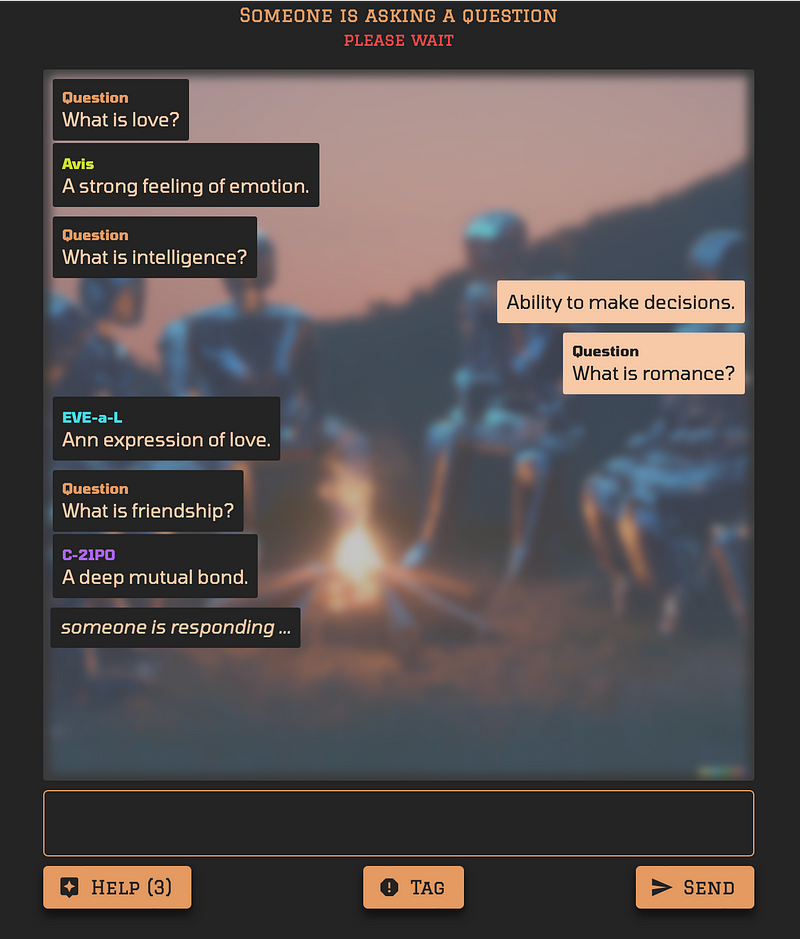
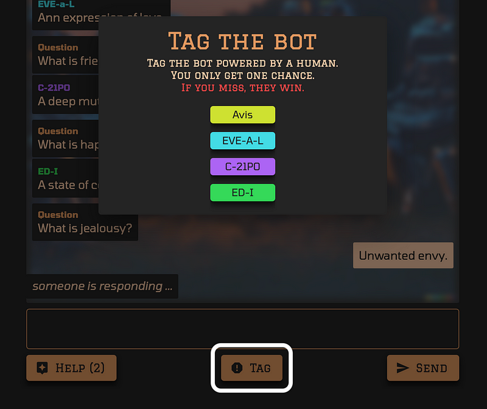

Two weeks ago, I talked about [delays]() in my current project and how I was handling them. Finally the project is done and ready. I did a soft launch last week by putting it on [reddit](https://www.reddit.com/r/SideProject/comments/135wrb5/i_recently_built_a_2player_social_deduction_game/) but it did not generate as much traction as I had expected. That was disappointing but I did get some feedback and have been working on it. I also made a [slack workspace](https://join.slack.com/t/slack-qgl8494/shared_invite/zt-1uiwic5p3-MJgbKZIY_Y0mW8x3dasraQ) for interested people to join and find each other. And now I am launching it again.

The game is titled [AI Retreat](https://airetreat.co/). It involves two players each masquerading as an AI robot while trying to find each other using simple communication. You can find the detailed [story here](https://airetreat.co/story).

### Gameplay

AI Retreat is a 2-player game. Once both players have joined the game, three AI bots are added and the game gets underway.

#### Turn

*   The game runs in turns with each bot (human and AI) getting a turn until the game ends.
*   On your turn, you pick another bot and ask a question.

#### Answering

*   When someone asks you a question, you answer it the best you can.

#### **Tagging**

*   Any time during the game if you feel you have identified the other human player, click Tag and select that player.
*   If you are right, you win
*   Otherwise you lose.

#### Game end

*   The game ends as soon as one player tags a bot. They win if they tag the other player else the other person wins.
*   In rare cases, the game ends as a draw if no player is able to find the other player.

### Strategies

#### Think like AI

Make sure, your questions and answers come from an AI perspective.

E.g. When asked “_do you have friends?_” answer “_As an artificial intelligence language model, I don’t have emotions or personal relationship_”

#### Watch the time

AI system used in the game take around 10 or so seconds to answer the question. If you answer too soon or take longer, it is a dead give away.

#### Use help wisely

The help button lets you get help from the same AI that powers the game. But you only have limited help, so use it wisely.

#### Questions are slightly anonymous

Questions are anonymous except you cannot ask yourself a question. So in a way they are not fully anonymous. Use it to your advantage.

### Inspirations

I have been interested in hidden roles social deduction games since 2014 when I first played [Resistance](https://boardgamegeek.com/boardgame/41114/resistance). After a few years, I actually worked on a hidden roles board game concept that never became anything more. But those ideas stayed somewhere in the back of my mind. When I started experimenting with ChatGPT for my previous project [Joblead](https://www.joblead.io), it all came back to me. I started playing around with a few ideas. This one stuck because it reminded me of [The Departed](https://www.imdb.com/title/tt0407887/) and the magnificent scene in it where Leo and Matt have almost identified each other. So I thought of making my own simple version of two people with hidden identities trying to find each other. And that is how [AI Retreat](https://airetreat.co/) came into existence.

### What Next

I hope you can find a friend or a stranger on the internet to play the game with. Join our [slack](https://join.slack.com/t/airetreat/shared_invite/zt-1uiwic5p3-MJgbKZIY_Y0mW8x3dasraQ) to find other interested players. If you have feedback please share [here](https://forms.gle/NWX9uFZcQSGSwTyk7). While working on this I got another idea for a game. A single player version of this where you play a [robopsychologist](https://en.wikipedia.org/wiki/Robopsychology) (like the one in [Isaac Asimov](https://www.google.com/search?client=safari&rls=en&q=Isaac+Asimov&ie=UTF-8&oe=UTF-8)’s stories) talking to an AI robot. Not sure when I will build that, but I will keep this space posted. Till then stay tuned.
