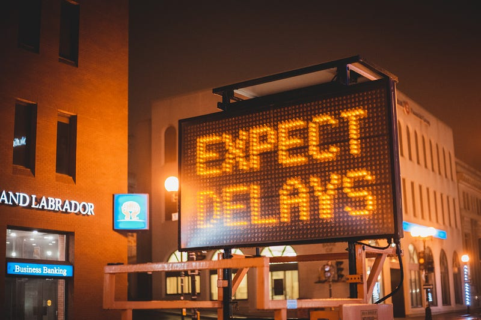
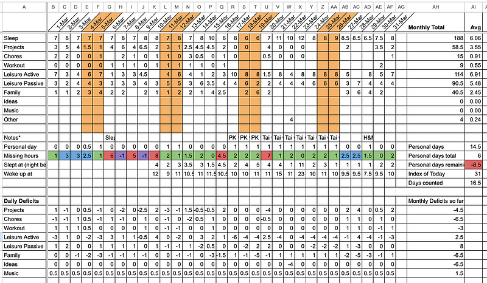

My current project has been going on for more than 2 months. That means compared to the original plan it has had a 150% delay. It has been disheartening but I was able to bounce back fairly quickly from it. Here’s how.

### Delays happen.

I have been working as a software professional for more than a decade and I have rarely seen a project completed exactly in the allocated timeline. One obvious reason is mistakes made during estimation. To get better at estimations, simply watch [Uncle Bob’s talk](https://www.youtube.com/watch?v=eisuQefYw_o) on the same topic. Here, I will discuss what can we do to prepare ourselves for the inevitable delays. This post is not about avoiding delays. It is about acknowledging them and handling them. Some delays are avoidable, others are not. It is best to accept that delays happen and devise ways to overcome them.

### Types of delays

In my current project, I have faced 3 delays so far and each was a different type of delay.

#### The wrong decision delay

Developing software involves a lot of decision making. The more experienced one gets, the better they get at decision making. But every once in a while, one makes an incorrect decision. I did the same. In an attempt to save costs, I decided to try Firebase instead of my tried and tested Postgres. The decision was made carefully and I accounted for a possiblity of rolling back to Postgres if needed. I was fully aware that a mistake would lead to a delay. But it seemed that the saved costs would be worth the risk of a delay.

#### The cascading delay

I was aware that the Firebase risk would cost me a few weeks. What I did not consider was that this would push the project timeline into my preplanned holiday. The result of my earlier delay was another delay and 2 weeks became 4 weeks.

#### The emergency delay

The previously mentioned delays could have been avoided, if I had made different choices. But not this one. A medical emergency required me to fly back to my hometown and spend some time there because family comes first. This added a few more weeks.

### Handling the delays.

Irrespective of the type of delay, they all affect me the same way. I panic and start overworking. Panic is bad and it makes things worse. Overworking is only sustainable in short bursts and quickly degrades quality of life. But this time, I was able to avoid these effects. When I started working independently, I put together an accountability system for myself. I did this using the most versatile productivity tool. Google sheets. Or Microsoft Excel as they are more or less the same.

I used two google sheets, one to track my time and the other to track my project.

The time tracker is the more complex of the two but is still very simple. Every column is a day and every row is a task (or category of tasks) that I do regularly. A few formulae help track daily time targets and easily display monthly deficits. That’s it. As simple as it sounds, it is quite powerful. I was able to quickly glance at it a few days ago and accurately pinpoint every delay in my project. A little notes section indicated the cause of each delay.

The project tracker is even simpler. It is a todo list with a time duration and a projected end date that auto updates. In case of a delay, a delay row is inserted in the project tracker that updates the new end date of the project.

### Small changes lead to huge improvements

Working independently is hard for me and these simple things have massively helped. They keep me accountable while still ensuring that I am not overwhelmed when things do not go as planned. Before I had this system, the delays would have lead to either high stress or tremendous demotivation or both. Now with this small change, I am relatively stress free and moving forward at a considerable pace.

Assuming the current delay is the last one, the new project will be out in the coming week. Keep an eye out for it. And while you wait, go checkout my first project, [JobLead](https://www.joblead.io). It is a job search website that finds jobs matching a given resume.

### Tell me what I missed

Is there a delay you faced that does not fall in one of these categories? How did you overcome it? Please share in the comments and stay tuned for my next post.
