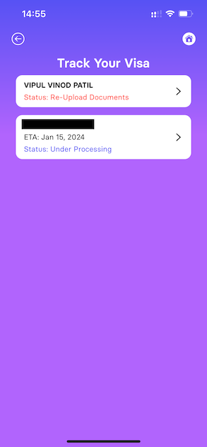

It is January again and here is my first post. Last year was my most successful year as a blog post writer. I posted more in the last 12 months than I did in the previous few years put together. So this first post was going to be a summary of last year and what is new. Instead, it is a customer’s analysis at understanding how a product faltered. Using an Engineering lens, we will examine how multiple small issues all aligned to create a big problem for the customers. This is a long read but I will try to keep it less rant-like and more informative and interesting. I might not succeed, but I will try.

Atlys is a visa application startup. I first came across Atlys around the end of the 2023, and was immediately impressed by the first look of their app and marketing material. A quick google search showed a seemingly good product, made and run by a seemingly well funded startup. I was impressed and excited. I needed visa for my upcoming Singapore trip and instead of asking around and finding a local agent, I decided to try Atlys.

### The experience

I downloaded the application and searched for Singapore and a message flashed saying _Visa guaranteed by 15th January_. This was happening on the 1st of January and this seemed a little too long compared to Google Search recommended timeline of 2–3 days. I assumed they were being cautious and adding a few more days. So after some consideration, I decided to start with the application.

The application was for 4 people. Myself, my wife and my parents. After adding my details, I added my wife’s and then noticed **the first issue**. They had asked for a passport pickup address which was common for the entire application. Since me and my parents are in different cities, I decided to finish my application before starting with theirs. Next, I connected my Google account instead of manual uploading our trip plans. I assumed they would pick up the flight and hotel bookings from my inbox, **but nothing in the app indicated this**. I made the required payment and was told, my application is in process and once again an ETA of 15th January was clearly shown. I was happy.

I moved on to making a second application for my parents. As soon as I started, the application began to show **same major issues**. I could not apply for my parents without my passport getting auto populated. Initially I thought I must have pressed a wrong button somewhere. But it turned out, I couldn’t create a new application for someone else. So I went to my in progress application and tried to add people to it and there was no way to do that either. The app seemed to have no way of applying for more people and the cross referencing of my passport and data, made me feel that if I proceed I might mess up my own in-progress application as well. Even now (3 weeks later), **the app incorrectly shows my passport address as my pickup/delivery address even though I entered a different one**. No idea if it scanned the address from my passport or if it used the pick up address from my parent’s unfinished application.

Even at this point, I was not too disappointed with the product. I assumed these little things will get fixed with time, believing the core product experience would be awesome. If I am being honest, the design was so good, it simply masked the bad engineering underneath.

I proceeded to download the app on another phone, create another account and went through the steps again for my parents. For their case, since I did not want to connect my Google account, I manually uploaded the bookings. The application was completed, I made the payment and was greeted with the same message as before, an ETA of 15th January. I was happy once again.

Things slowly started falling apart over the next few days. My parents passports were picked up within 2 days while my application remained stuck in the initial phase. I had to call customer support to get them to schedule a passport pickup. Soon my parents application asked for additional documents but mine simply sat around without much update. A week passed by and my parents application was moving ahead at a slow but steady pace, while mine was stuck somewhere. The app simply failed to provide any meaningful updates.

When additional documents were requested, one of the document requested was 6 months bank statement. I received an auto-generated email asking to upload the same within the app. When I tried to do so in the app, the app only allowed taking a picture. How do i take a single picture of a 6 months bank statement. I started realizing the product was not at all as good as it seemed to be.

From this point onwards, all the flaws in the system (engineering as well as human) became glaring. I contacted customer support to provide the documents they were asking for. And the first thing the customer support person told me was to upload the documents in the app. When I explained it was not possible, they recommended a way by email. Now having worked with various startups over the years, I understand the philosophy of [Doing things that don’t scale](https://paulgraham.com/ds.html) but this seemed a terrible implementation of it. If they knew I could not possibly upload the requested documents via the app, might as well request them by email. Why make the experience so full of friction? After I sent the documents via email, I waited a day but the status within the app did not update. It still said, that I needed to upload required documents. So I called customer support again. They told me that my application was waiting on the required documents, which I had already emailed two days earlier. It became clear to me, that this was more of an engineering failure than a human one. I realised that someone had received my documents and hopefully had attached it to my application but had not updated the system. I can only guess why this happened. Either the person forgot or the system does not have an easy way to update the status on app. The second reason felt much more probable, once I checked my parent’s application. It had been completed in the promised time with the visa issued and passport returned. Although the app still showed that documents were required to be uploaded, even after their visa had been approved and passport had been delivered.

This gave me hope that my visa will come through in a day or two. But that hope was shattered when I found out my application had reached a different center than my parent’s. Once I looked at X (formerly Twitter), I realised all applications at the Chennai center (one where my application was sent) were in the same boat as me. My parent’s application got sent to the Bhubaneshwar center and passed through with minimum hassle. Minimum but not zero. My application which is supposedly complete and submitted still shows incorrect update on app.

In summary, the design and promotion of the app seemed to have been a higher focus for the makers compared to actually getting the product working well.

### The analysis

It is clear to me that the delay in my visa approval (and several people according to X) was caused by multiple bad things all synchronizing together. The issue was local to Atlys’s Chennai center. This would lead one to believe that it was simply a human or technical error at that particular center. But I disagree. I think the specific situation at the Center simply exemplified the critical flaws within the engineering of the product.

#### Problem 1: There was an extra long weekend and no one prepared for it.

The 3rd week of January had 3 public holidays at the center where our applications were sent. The company should have been privy to this information and applications that were supposed to be delivered by 15th of January should not have been sent there. Even if they were, they should have been processed at priority or Atlys should have intimidated the customers of this problem.

#### Problem 2: The app did not provide up to date information

When I was first sent a request for additional / missing documents, the app did not update to show that this would affect the guaranteed date. I initially assumed this might be because they had already factored the document requesting time. But after submitting the documents via their recommended email, when the app (as well as customer support) still kept telling me that the application is waiting on documents, I realized that the system was not built to handle such use cases. I would expect, requesting of documents to be one of the most common use cases. This should have already been built into a minimum viable product, let alone one that has been launched for an extended time. This lack of update meant I could never trust the app and had to constantly contact support to get updates.

#### Problem 3: Support were unaware or not informed of the extra long weekend

In the week prior to 15th January, I was told that my application was in process of being submitted and it would be completed by 15th. When I found out that the Singapore embassy in Chennai itself is closed for 3 days, I realized that Support was simply provided with incorrect information or were asked to not share the same to customers.

#### Problem 4: The app (and the backend system) is bad in so many ways

Here are a few examples where the app clearly is incomplete.

1.  When uploading requested documents, you can only take 1 picture per document. There is no option to upload multipage documents.
2.  There is a section called my documents. But it’s a page that just takes you to your current visa process. There isn’t any way to manage or actually add documents outside of a visa application. In which case, why even have a my documents section.
3.  I created a single application for me and my wife. And I see one section for each of us in the _my documents_ page. But I cannot add more people. The only way to add more people is to go through a full visa application process (including paying the fees) and even then they all need to have the same pickup / drop address.
4.  The first application I made, I setup my own pickup/drop-off address. When I started a new application for my parents, I entered their pickup/drop-off address. But then it auto attached my passport (which was uploaded earlier) to their application as their passport. So I discontinued the application. But now, it had already overwritten my pickup/drop-off address and now I have no way to update it other than starting yet another application.
5.  The application page shows the status of the application, alongwith screenshots/photos. Turns out, everyone sees the same generic photo/screenshot but it is made to appear that it indicates where our passports are actually kept. If the photo is not going to be the actual photo taken, why even have a photo.
6.  Finally, the ETA for an application seems to be hardcoded into the app. For Singapore, it is 14 days (or 10 working days). It does not matter that the actual number of working days might be less. When I looked at a new application on 12th of January, it showed me that I would get the visa by 26th of January without considering the fact that there were only 5 working days for them to actually achieve it (assuming it goes to Chennai center).

I can go on and on. The engineering in this product is so poor, that it was never going to be able to handle an unexpected delay. As a Product Engineer I can see so many holes in the product experience. I believe that fixing some of these product issues would highly alleviate a lot of the currently happening problems.

### The Resolution if there is/was one

There were so many things that could have been done differently in this entire story. Here are a few ideas that everyone can learn from.

1.  The Atlys Team should have been aware of the working days and upcoming holidays for every visa center. The app should reflect a visa ETA that accounts for all known holidays.
2.  Once application came close to their respective ETAs, alarm bells should have been ringing at the Atlys offices. Someone from leadership should have stepped in, to address the delays which seemed specific to the Chennai center.
3.  If the above was done, it would have been immediately clear that several application will not make there ETA. Atlys team should have proactively reached out to applicants in order to find a solution whether it is cancelling the application or a change of travel plans.
4.  Even before the extra long weekend, the Atlys team had several open applications which did not get processed in a 2 week timespan. Any application that is not updated for more than 3 days should have been immediately auto-escalated up the hierarchy at Atlys.
5.  On a whole, the backend and frontend application seems to be put together and launched without even the bare minimum features. Now I am not aware of the Engineering Leadership situation at Atlys, but a strong Engineering voice can avoid a situation like this. This feels like a case where product presence was expanded to support multiple countries without Engineering catching up to even the most basic features.
6.  I picked Atlys because they caught my eye when i was looking for visa application solutions. Since then, Atlys shows up a lot in my advertising feed. This makes me believe they have a large marketing budget. But the terrible state of the actual product indicates that the money would have been better spent on product.

I am not sure, if anyone from Atlys will ever read this. But I feel a lot these lessons apply to other startups and businesses as well. Things go wrong often, but they become worse if the core of a business is not strong. I signed up for Atlys because it seemed like a strong technology company, but now I know that is not the case. And given that the claims they made regarding my visa turned out to be false, I cannot trust the other claims they make regarding how many visas they have processed successfully.

As annoyed as I am as a customer, as an Engineer I still have some sympathy for Atlys and wish them well. My flight is a few days away, so if I can get my visa on time, all of this will be water under the bridge. Either ways, I don’t think I will use or recommend Atlys for a long time.

### Stay tuned

If you are still with me, wish you a happy new year! I hope your January has been smoother than mine. Unlike this post, I generally write about my own projects and journey as a Software Engineer. If you would like to read more, consider following me here on medium or on Twitter at [vipulvpatil](https://twitter.com/vipulvpatil).
