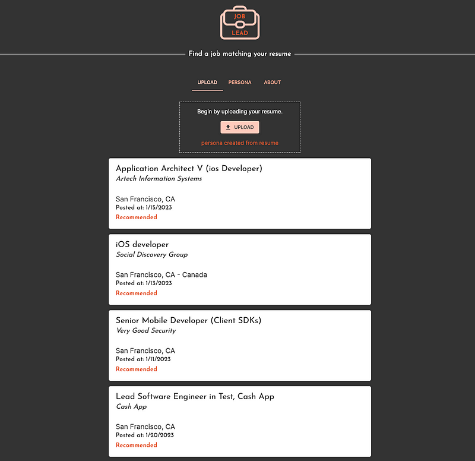

Exactly 19 days ago was my last day at Coinbase. The plan was to make my side project my full time project after my employment ends. On my first full day of working on the side project, I found out that I was in murky waters. My project involved a potential violation of the terms and conditions of the API used. It was clear that proceeding with the project was risky as it was unclear if I could put it into production. So in accordance of my new vision (more on that later) of _releasing projects to the public_, I decided to put that project on hold and start looking for a new idea.

Before I get ahead of myself, allow me to quickly explain my current plan of action. As I work on my own personal projects, I have three key goals. The first is to **Release projects to the public** so I can get real world feedback**.** The second is to **learn the non-programming aspects of running software projects**. And the third and probably the most important goal is to **Build projects that can be monetized in some way.** This is my own interpretation of the fantastic idea by [levels.io](https://medium.com/u/75452cb7f664) to do [12 startups in 12 months](https://levels.io/12-startups-12-months/). My implementation is a little different but the motives are the same. I might expand upon my iteration and my processes in a later post. Now let's get back to the project at hand.

My dalliance with AI began in late 2018 while talking to a close friend. Back then I believed that AI systems would eventually replace human jobs in a far away future. And software development jobs would be the last one to go, because someone will be needed to write and maintain all the AI software. Now as I see what [OpenAi](https://beta.openai.com/playground) can do, I know I was wrong on all fronts during that conversation. Irrespective of my opinion, I realized I knew frighteningly little about AI and ML and decided to rectify that. I spent the next few months studying an [introductory ML course on Coursera](https://www.coursera.org/learn/machine-learning) taught by Andrew Ng. The course helped me understand the basics of ML but I decided this was not a field of study that aligned with my intended personal growth direction at the time being. So I pushed AI to the back of my mind.

Fast forward to January 2023 and I was looking at ChatGPT and OpenAi. I wasn't looking at AI based ideas only but it no longer back of mind. The first good idea I had was to build a resume analyser that would look at resumes and suggest improvements. One google search later, I saw that this had been done a lot. So I dropped this and moved to other ideas. Eventually after a day or two of toying with a few options, I came back to this idea because currently a lot of people are looking for jobs. In an attempt to assist with people’s job search, I built [joblead.io](https://www.joblead.io/). A website that uses OpenAi to analyse a given resume and then suggests jobs matching the resume.

[Joblead](https://www.joblead.io/) is fully built using [NextJS](https://nextjs.org/) and is very server lite. The system accepts a resume and uses OpenAi to derive meaningful data from it. Then it uses this data to search for appropriate jobs online. No user data is saved on the server during this time. The project itself took around 14 days to build and has around 7000 lines of code as of this writing. If you are looking for a job do give it a try and if not go check it out anyways.

If you have any feedback, you can directly reach out to me or leave it [here](https://forms.gle/VNZHpkqXGfJpXyp88). For more about this, me and my other projects, follow me on medium and stay tuned for my next post.
