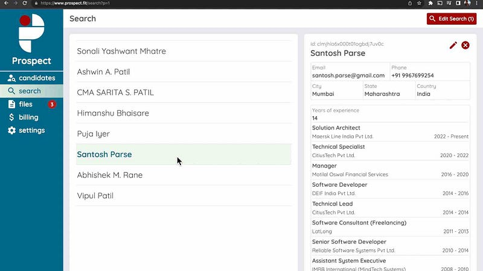

AI is starting to permeate a large number of products and industries. It is too soon to call this the _age of AI_ but we are certainly moving in that direction. Irrespective of whether we actually reach such a time or not, it would be prudent to ignore AI as just another buzzword. It is here to stay and the only question is _how can you use it to improve your business and/or productivity?_

In order to familiarize myself with [Open AI APIs](https://platform.openai.com), I built a simple [job seeker website](https://www.joblead.io) and a [multiplayer game](https://airetreat.co). After gaining some experience with the APIs, I decided to solve a more pertinent problem. While building [Joblead](https://www.joblead.io), I found a few tools that helped users create resumes using AI. I noticed these to be severely lacking. I also noticed that there were no simple tools for recruiters to leverage the recent AI advancements. Their only options were to signup on a more full fledged services like [Rippling](https://www.rippling.com) that provides a vast employee management system or [Lever](https://www.lever.co/) that provides an extensive hiring management system. So in order to provide the simplest resume management tool, I built [Prospect](https://www.prospect.fit/).

[Prospect](https://www.prospect.fit/) is a simple tool that provides recruiters with the ability to upload resumes in PDF format and converts it into searchable data. Once converted, recruiters can quickly find candidates with relevant information.

Looking for candidates with a degree in architecture, just search by `education contains "architecture"` .

Want to only look at candidates with 8 or more years of experience, just ask for `years of experience > 8` .



By using fine tuned prompts, [Prospect](https://www.prospect.fit/) is able to extract relevant information from a wide variety of resume styles. I am constantly working on improving the AI prompts to deliver even better data extraction. The extracted data is stored securely and is available for quick searching. The search capabilities allow for more complex filtering to narrow down the results as needed.





You can [try Prospect without signing up](https://www.prospect.fit/search?testMode=1). Prospect is currently free to use and recruiters will find it to be highly effective at managing a large number of resumes with minimum hassle. Do give it a try and provide your [feedback](https://forms.gle/JrmFLJCM7r9xQHdL6). You can also email me at assist.prospect@gmail.com or vipulvpatil@gmail.com

Prospect marks the beginning of the end of my [8 months long experiment](https://medium.com/@vipulvpatil/the-idea-the-plan-and-the-journey-so-far-f46ffb8db9f5). I will continue to improve and support Prospect for the foreseeable future. If you would like to know how this story turns out, please consider following me here or on [twitter](https://twitter.com/vipulvpatil) and stay tuned for my next post.
