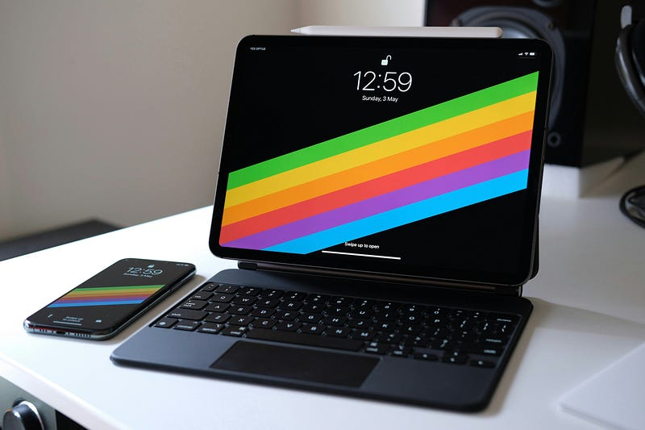
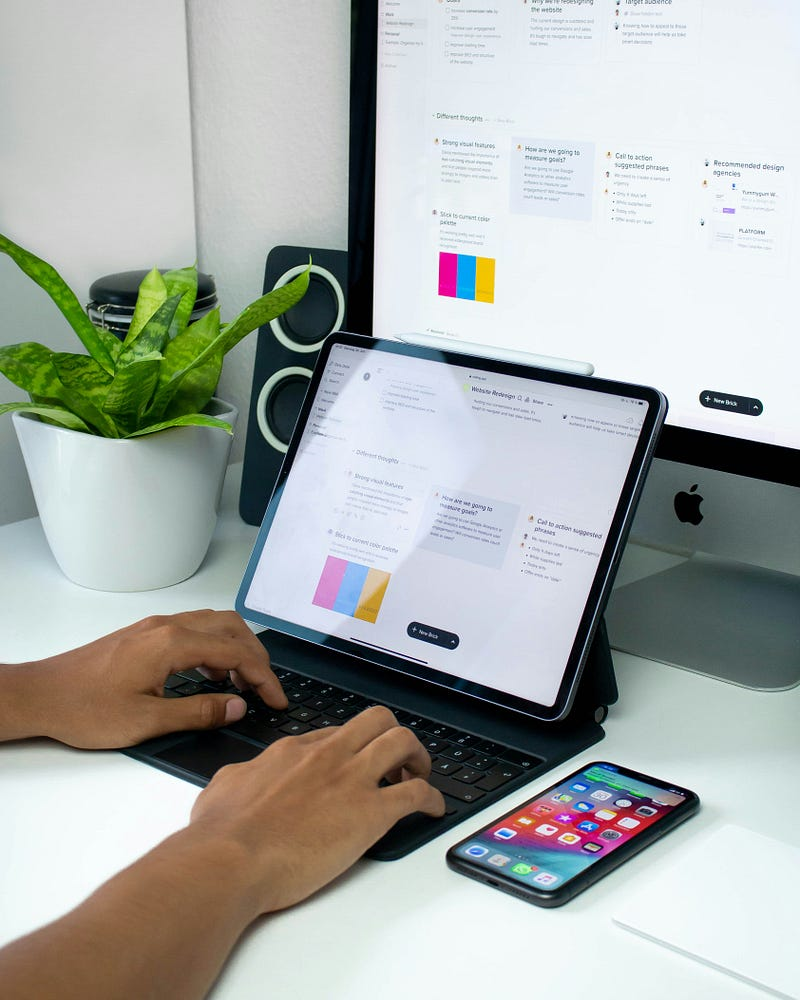
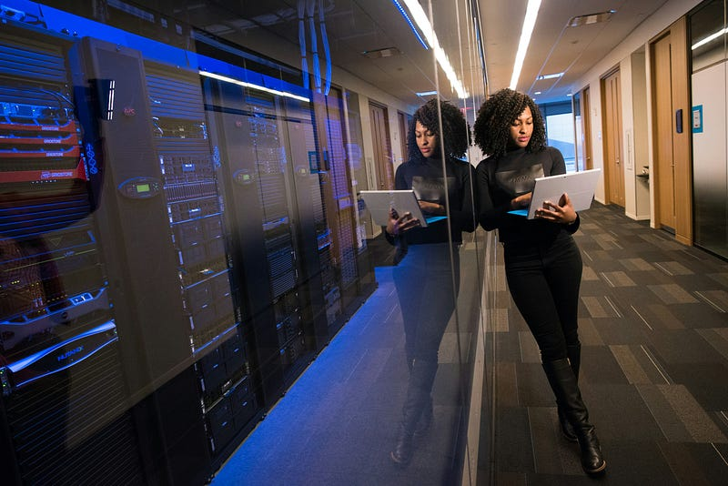
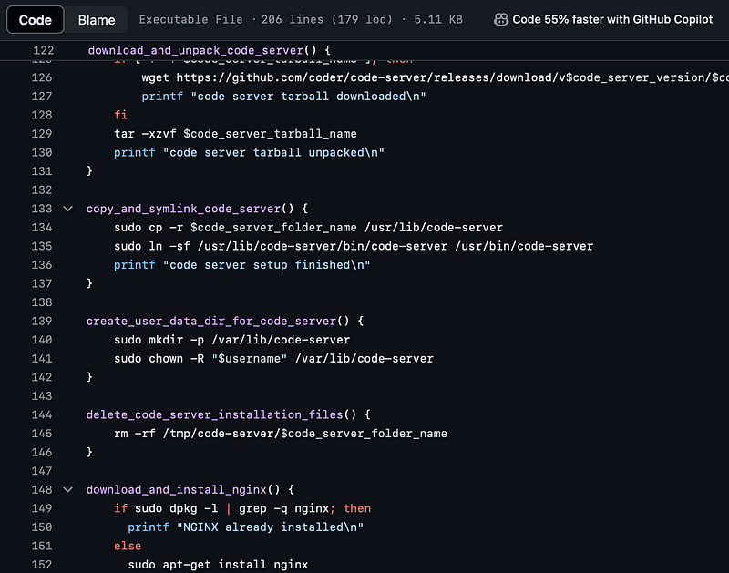

**tl;dr** In pursuit of justifying an impending iPad Pro purchase, I am attempting to fully embrace remote development for all my programming activities. The first milestone is captured by [this setup script](https://github.com/vipulvpatil/code-server-setup).

### A little background

The M4 iPad Pro was launched on May 15, 2024. I spent the next few days watching the new iPad on Youtube, reading reviews and seeing people debate whether the new nano-texture screen was better or worse. As an Apple fanboy, I have wanted to own an iPad since the first one came out. As a pragmatist, I knew it always had very little utility and too high a price point. At the launch of every new iPad, the pragmatist in me would win and I would move on.

However, a few things were different this time.

1.  The new iPad had a more updated processor compared to the MacBook line released a few months prior.
2.  My 2018 Intel MacBook Pro wasn’t exactly outdated but it did feel slower. It even felt bulkier and heavier.
3.  I now valued portability over raw power. So I was considering replacing my existing MacBook Pro with a new MacBook Air.
4.  The cheapest M4 iPad Pro along with a Magic keyboard would cost and weigh more than the cheapest M3 MacBook Air. But only by a small margin.

One key thing hadn’t changed at all.

1.  iPad OS was still heavily underpowered and restricted the user from truly realizing the capabilities of the hardware underneath.

Until Apple did a major overhaul of iPad OS, I knew the device would never be a one to one replacement of a MacOS powered system. I needed it to do just enough to enable me to travel without my bulky MacBook. I use my MacBook for a lot of things but the single most important thing I do on it is programming. So I set out to see if I could do that on an iPad.

### What I needed

I have been a professional programmer for more than a decade and I love dabbling into side projects often. I mostly do backend programming in [Go](https://go.dev) and build my frontends in [Next.js](https://nextjs.org). I sometimes run an instance of [Postgres](https://www.postgresql.org) and/or [Redis](https://redis.io). Given the restrictive nature of the iPad OS, developing directly on the iPad was not an option. I quickly moved to the next obvious alternative, Remote development.

Remote development involves connecting to a remote machine and programming on it. This is not a new concept and many tools exists for the same. I had previously done some remote development using [neovim](https://neovim.io) and [ssh](https://www.cloudflare.com/learning/access-management/what-is-ssh/#). Here is an article that explains how to setup [neovim for remote development](https://alpha2phi.medium.com/modern-neovim-lsp-and-remote-development-9b1250ee6aee). Although it is possible to run ssh[¹](#4f3e) with vim on iPad, I was not a vim power user and preferred [VS Code](https://code.visualstudio.com/).

VS Code already supports remote development in tandem with various cloud based services. [Github Codespaces](https://github.com/features/codespaces) is arguably the most well known. It does provide free limits but anything beyond hobbyist usage is bound to quickly get expensive. Other alternatives like [Coder](https://coder.com) and [Gitpod](https://www.gitpod.io) also provide development environments in the cloud for a price but none seemed right for me. Additionally, Coder has an Open Source version that can be self hosted and comes with plethora of features including multi IDE support and user management via OpenID Connect. Coder goes one step further and also provides [Code Server](https://github.com/coder/code-server) which enables running VS Code on a remote machine and access it via a browser. In effect, as long as I had a remote machine running Code Server, I could use any browser to code in a VS Code like IDE[²](#7361).

### Setup

I decided to have Code Server running in a remote machine on [Digital Ocean](https://www.digitalocean.com). My first choice was going with Alpine Linux due to its lighweight nature. But this remote system was intended for more interactive usage than my average server. So I went with Ubuntu instead and it came with most of my required functionality out of the box. After a few iterations, I had a fully working setup.

Below are the steps, I followed to setup Code Server on an ssh-enabled remote Ubuntu machine (Digital Ocean Droplet) and make it publicly accessible via Nginx.

1.  SSH into the newly provisioned machine running Ubuntu.
2.  Create a non-root user as it would have been irresponsible to use [root user on Linux](https://askubuntu.com/questions/16178/why-is-it-bad-to-log-in-as-root).
3.  Enable SSH for this newly created user.
4.  Download, install and configure Code Server.
5.  Download, install and configure Nginx.
6.  Setup SSL for the server. _Optional_[³](#f1d7)
7.  Configure netfilter firewall.
8.  Start Code Server and Nginx.

These steps have been codified into a shell script. You can find it [here](https://github.com/vipulvpatil/code-server-setup/releases/download/v1.0.1/code-server-setup-1.0.1.tar.gz). A more detailed walkthrough of the script is available on [Github](https://github.com/vipulvpatil/code-server-setup). Since the script could be modified in the future, it may no longer match the steps provided above. Please refer to the Github for the latest version.

### Future

This setup seems to be holding fine for the last few days but it hasn’t been stress tested yet. Over the next few weeks, I intend to continue writing simple projects within this setup and attempting to cover as many of my development use cases as possible. If all looks good, maybe I will take the plunge and buy me my first ever iPad Pro. If not, maybe a new MacBook Air would be the better choice.

I am still early in my experiment, but this isn’t the first attempt at using iPad as a development tool. [Many](https://lgallardo.com/2022/01/25/ipad-pro-as-a-portable-workstation/) [others](https://arslan.io/2019/01/07/using-the-ipad-pro-as-my-development-machine/) have done similar things over the years. [Some](https://technicallychallenged.substack.com/p/buying-an-ipad-pro-for-coding-was) found the device to be inadequate and I might reach the same conclusion in the future. Or maybe Apple will enable some form of MacOS in a future version and put this entire ecosystem into overdrive. We will have to wait and watch, but the future does seem exciting.

If you liked that this little project, do star it on [Github](https://github.com/vipulvpatil/code-server-setup). If you want to know more of where my experiment goes, consider following me here on medium or on Twitter at [vipulvpatil](https://twitter.com/vipulvpatil).

1 [^](#be5b). [Termius](https://termius.com) and [Blink](https://blink.sh) provide ssh functionality in iPad OS

2 [^](#4ef7). VS Code on the web does not have 100% feature parity with the desktop version.

3 [^](#2734). Setting up SSL is optional but recommended. Additional setup is required to do this correctly.
